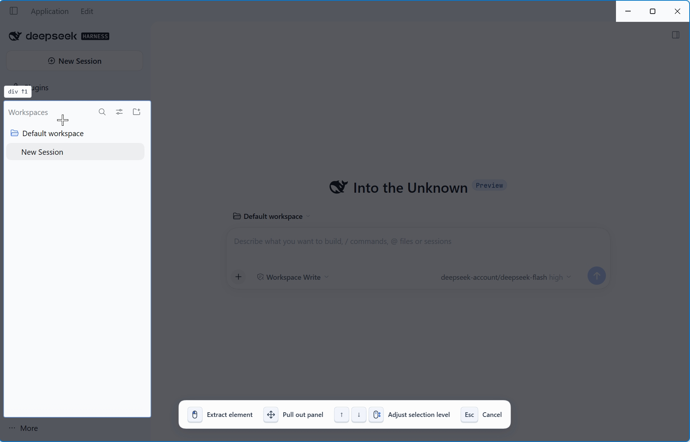
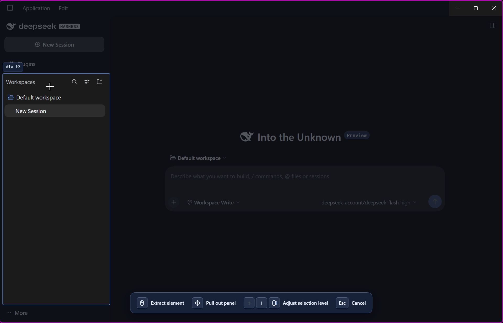
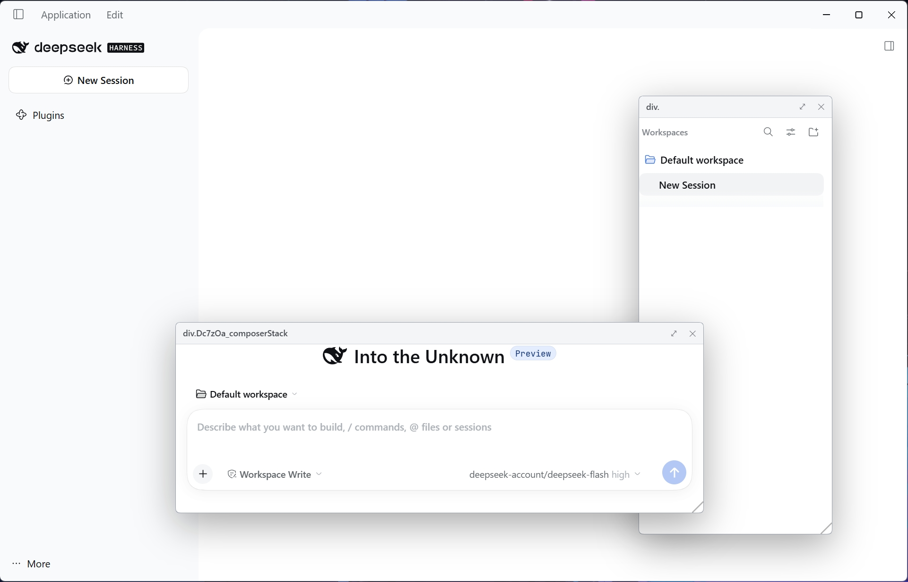
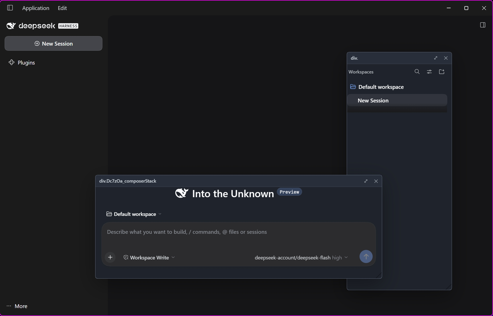
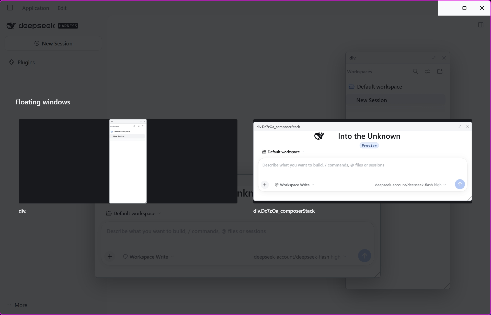
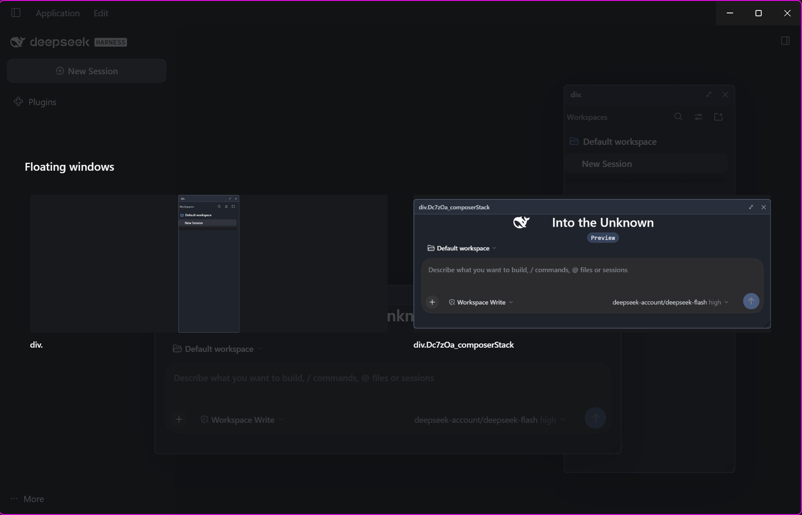

<div align="center">

# dsh-better-float

**Turn DSH interface elements into floating panels you can keep within reach.**

[中文](./README.md) · English

[Screenshots](#screenshots) · [Quick start](#quick-start) · [Controls](#controls) · [Development and verification](#development-and-verification)

</div>

Pick a page element with a keyboard shortcut and move it into an in-app floating panel. Drag it, resize it, keep interacting with it, then use the window manager to find and reposition it.

- **Adjustable selection**: point at an element and use the wheel or arrow keys to move through its ancestor and child hierarchy.
- **Real elements first**: move the original DOM node rather than a screenshot, preserving content, state and interaction where possible.
- **Multiple movable panels**: drag the title bar, resize, click to bring forward, and close to restore the original position.
- **Floating window manager**: browse screenshot previews, select a panel, then click where you want to place it.

> [!IMPORTANT]
> The standard plugin currently provides **in-app floating panels**, not independent OS windows. Detaching, native always-on-top and click-through require additional Desktop host integration; the ⤢ button does not mean those capabilities are already available. See the [host integration guide](./desktop/INTEGRATION.md) and [capability assessment](./docs/popout-host-capability-assessment.md).

## Screenshots

These are real captures of the **English-language interface** in light and dark themes, following the complete workflow: pick an element, float and interact, then manage panels. The [Chinese README](./README.md#实际截图) shows the corresponding Chinese-language captures.

### 1. Pick an element

In pick mode, the selected area is highlighted while the rest of the interface is dimmed. Use the arrow keys or wheel shown in the bottom hint bar to adjust the selection hierarchy. These captures show the workspace list selected in the sidebar.

| Light theme | Dark theme |
| :---: | :---: |
|  |  |

### 2. Float and interact

Pull elements out of their original layout, then move and resize them. These captures show the workspace list and composer as two floating panels that can be positioned and used independently.

| Light theme | Dark theme |
| :---: | :---: |
|  |  |

### 3. Manage floating panels

Browse panel previews. Selecting a preview enters crosshair placement mode; your next click sets the panel's top-left position.

| Light theme | Dark theme |
| :---: | :---: |
|  |  |

## Quick start

### Install into DSH Desktop

You need an installed DSH Desktop app, plus Node.js and npm capable of running this project's development dependencies. Run these commands from the repository root:

```bash
npm install
npm run check
npm run which:home
npm run install:dsh
npm run verify:dsh
```

Then **quit and restart DSH Desktop**, and press `Ctrl+Shift+S` to pick an element. Reloading the window is not enough: plugin configuration is composed at app startup.

> [!WARNING]
> `install:dsh` copies plugin files and adds a plugin entry to the Desktop profile's `cordis.patch.yml`. This changes your local DSH configuration. Confirm the target with `which:home` first; do not install into `profiles/web` when targeting Desktop. The installer preserves existing user configuration entries.

To uninstall:

```bash
npm run uninstall:dsh
```

### Integrate into a DSH source checkout

Add the plugin as a workspace package, build it, and add an entry to the browser bundle's plugin roster:

```yaml
- insert:
    - id: better-float
      name: dsh-better-float
```

For independent OS windows, also integrate `desktop/popout-manager.ts` following the [host integration guide](./desktop/INTEGRATION.md), rather than importing Electron directly from the plugin Renderer.

## Controls

| Action | Windows / Linux | macOS |
| :--- | :--- | :--- |
| Start picking; press again to cancel | `Ctrl+Shift+S` | `Cmd+Shift+S` |
| Toggle the floating window manager | `Ctrl+Alt+Shift+S` | `Cmd+Option+Shift+S` |
| Select a parent / child element | `↑` / `↓`, or the wheel | Same |
| Confirm selection | Click the target, release a drag, or press `Enter` | Same |
| Cancel picking / close the manager / cancel placement | `Esc` | Same |

1. **Pick**: point at an element, adjust its scope with the wheel or arrow keys, then confirm.
2. **Float**: drag the title bar to move, drag the bottom-right corner to resize, and click a panel to bring it forward.
3. **Recall**: open the manager, click a preview, then click the destination to place the panel.
4. **Restore**: close the panel with `✕` to return the element to its original layout.

> [!TIP]
> Placement takes **two steps**: clicking a preview only selects the panel; it does not move it immediately. Press `Esc` before the next click to cancel placement without changing the panel's position.

## How it works

### Move nodes rather than copying the interface

The in-app path moves the real DOM node, preserving its object identity. Where supported and applicable, `moveBefore` preserves runtime state; otherwise, the implementation falls back and reports relevant warnings. DOM cloning or bitmap capture cannot equivalently preserve framework events, Canvas content, focus and media state.

### Keep a structural stand-in in the original layout

After extraction, `stand-in.ts` inserts a placeholder and intercepts relevant child mutations only on the original parent element. This handles framework attempts to remove or replace the old child, avoiding `NotFoundError` when it no longer belongs to that parent. Restoration releases the interception before returning the element.

### Preserve style context instead of inlining every style

The implementation first tries to mount the panel inside the real parent. When that is not possible, it rebuilds ancestor shells carrying tags, classes and `data-*` attributes, using `display: contents` to restore selector context. Container queries and Shadow DOM require special handling or degradation; arbitrary elements are not guaranteed to move without loss.

## Development and verification

```bash
npm run check           # Typecheck, build, bundle / inject / static checks and patch-edit verification
npm run spike:versions  # Probe the actual Electron / Chromium capabilities
npm run spike           # Open the bench and write spikes/report.json
```

The Electron bench needs a separate runtime binary. If it has not been downloaded locally, run:

```bash
node node_modules/electron/install.js
```

This downloads Electron for local experiments; it is not required for installing into an existing DSH Desktop app. The bench launcher removes `ELECTRON_RUN_AS_NODE` from the child environment so Electron does not run as plain Node.js.

| Command | Purpose |
| :--- | :--- |
| `npm run app:probe` | Inspect the running app and plugin boot entry |
| `npm run app:verify` | Check plugin activation and the panel layer through a debug port |
| `npm run app:debug` | Restart Desktop in debugging mode for diagnosis |
| `npm run verify:dsh` | Verify installed files and the location the host actually reads |

> [!NOTE]
> Static checks, plugin activation and bench results do not replace actual UI acceptance. Verify picking, dragging, resizing, restoration, and the manager's selection, placement and cancellation paths in Desktop. Historical experiments are recorded in the [implementation plan](./better-float-implementation-plan.md); they do not establish full support in the current host version.

<details>
<summary>Project layout and key entry points</summary>

```text
src/
  client/index.ts       Plugin entry, shortcuts and panel-layer registration
  scout/                Hit testing, hierarchy selection and highlighting
  capture/              Live movement, stand-ins, style context and fallbacks
  float/                Panels, dragging, resizing, manager and previews
  detach/               Detach gestures and cross-window transport protocol
  shared/               Types and DOM declarations
desktop/                Main-process implementation requiring host integration
spikes/                 Electron experiment bench
scripts/                Build, checks, installation and diagnostics
docs/                   Capability assessment and actual screenshots
```

Key files: `src/capture/tier0-live.ts`, `src/capture/stand-in.ts`, `src/capture/css-inplace.ts`, `src/capture/css-skeleton.ts` and `src/float/overview.ts`.

Host services arrive through `ctx.inject`; do not add `@deepseek-ai/*` value imports prohibited by the purity gate.

</details>

## Capability boundaries

- **Independent OS windows are not connected**: the repository includes Desktop integration code, but the standard plugin is not wired to main-process window capabilities. In the isolated host probe on October 1, 2026, `window.open()` returned `null`. This is a historical result for that version, not a universal conclusion about every version.
- **Cross-window transfer is not a live node move**: different documents / processes cannot use the in-app state-preserving path. The current cross-window design transfers a description and rebuilds content, with explicit interaction and state degradation.
- **Semantic rebuilding is not implemented**: Tier 1 needs host-side component identification or annotations; no general implementation exists yet.
- **Complex elements need real testing**: iframes, media, Canvas, Shadow DOM, container queries and framework updates can introduce edge cases. Success with ordinary controls does not establish universal compatibility.

## Further reading

| Document | Contents |
| :--- | :--- |
| [HANDOFF.md](./HANDOFF.md) | Developer handoff, module loading, inject and slot contracts |
| [TESTING-IN-DSH.md](./TESTING-IN-DSH.md) | Desktop installation and manual verification |
| [Implementation plan](./better-float-implementation-plan.md) | Design corrections, stages and historical experiments |
| [Host integration guide](./desktop/INTEGRATION.md) | Main-process and preload changes for independent windows |
| [Host capability assessment](./docs/popout-host-capability-assessment.md) | Plugin / host boundaries, the P0 probe and next routes |

Host source excerpts and local debugging artifacts referenced by the handoff are not distributed in this repository. Screenshots live in `docs/screenshots/`. Other documents retain their original languages.
