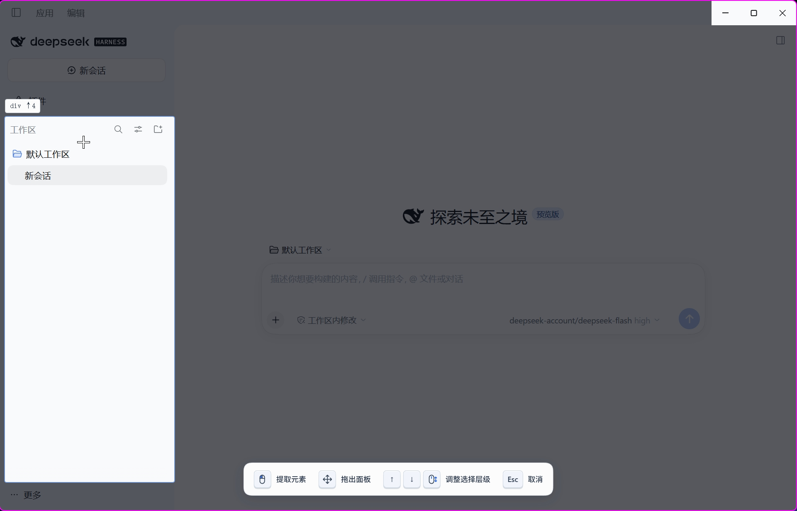
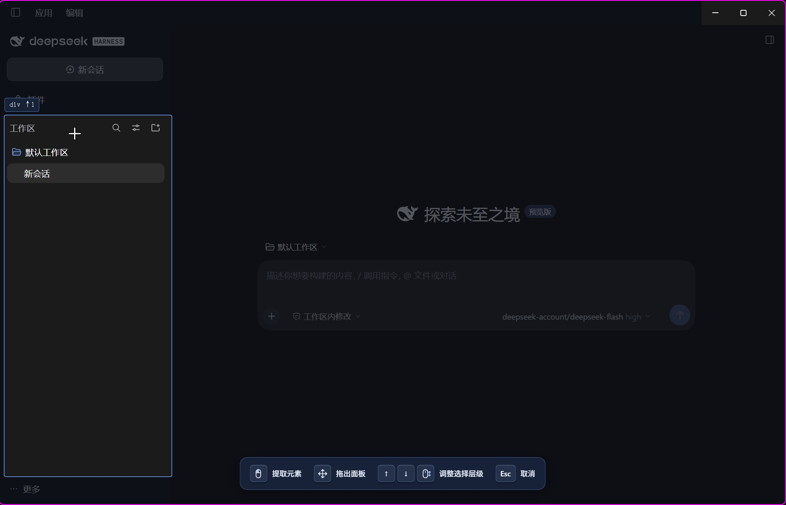
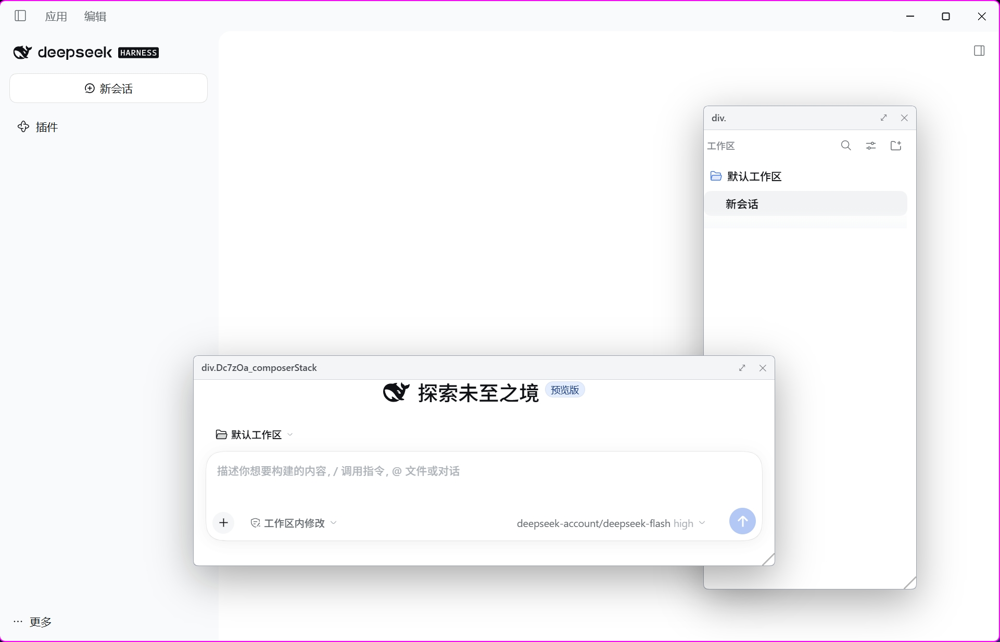
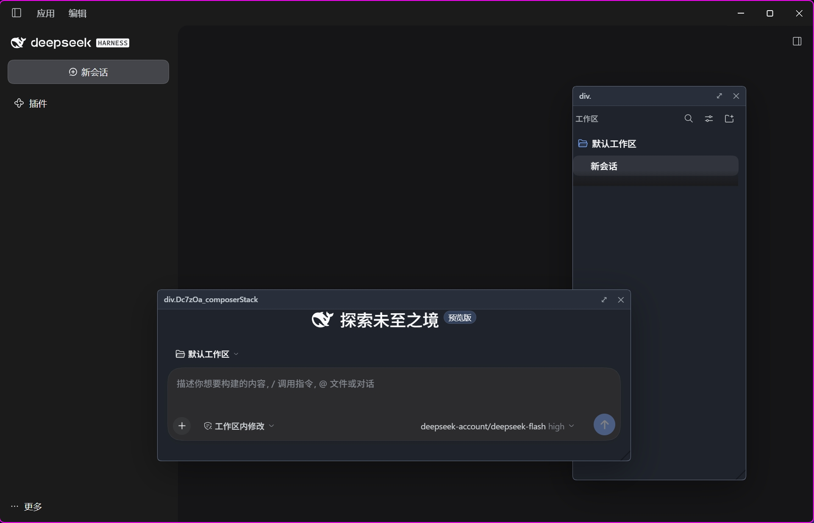
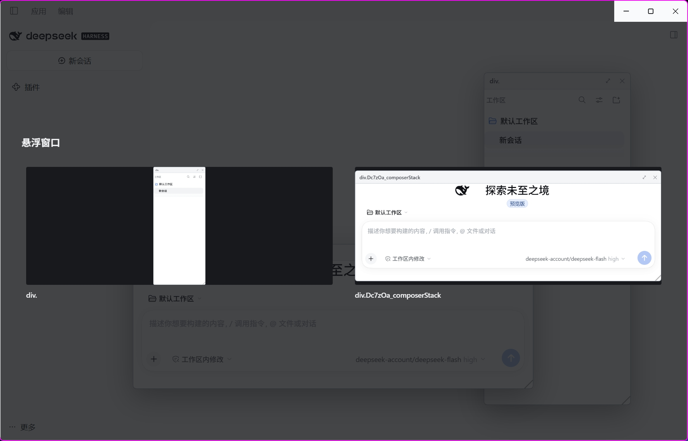
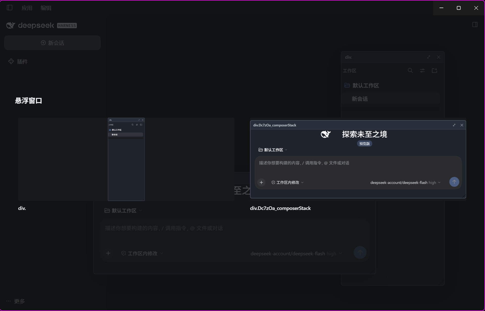

<div align="center">

# dsh-better-float

**把 DSH 中的界面控件，变成随手可用的浮动面板。**

中文 · [English](./README.en.md)

[实际截图](#实际截图) · [快速开始](#快速开始) · [操作指南](#操作指南) · [开发与验证](#开发与验证)

</div>

使用快捷键选中页面元素，将它移入应用内浮动面板：拖动、缩放、继续交互，再通过浮窗管理器快速找回并重新摆放。

- **选择范围可调**：鼠标定位目标，滚轮或方向键逐层选择父元素与子元素。
- **优先保留真实控件**：移动原 DOM 节点而不是复制截图，尽可能保留内容、状态和交互。
- **多个面板自由摆放**：拖动标题栏、调整大小、点击置前；关闭后恢复原位置。
- **浮窗管理器**：以截图缩略图浏览面板，先选中预览，再点击目标位置放置。

> [!IMPORTANT]
> 当前标准插件提供的是**应用内浮动面板**，不是独立的系统窗口。分离到系统窗口、原生置顶和鼠标穿透需要额外的 Desktop 宿主集成；面板上的 ⤢ 按钮不表示这些能力已经可用。详见[宿主集成指南](./desktop/INTEGRATION.md)和[能力评估](./docs/popout-host-capability-assessment.md)。

## 实际截图

以下为中文界面下的实际操作截图，分别展示亮色和暗色主题，按「选择控件 → 浮动与交互 → 浮窗管理器」呈现完整使用流程。[English README](./README.en.md#screenshots) 展示对应的英文界面截图。

### 1. 选择控件

进入选择模式后，目标区域高亮，其他区域变暗；使用底部操作提示中的方向键或滚轮调整选择层级，确定要浮动的控件范围。截图选中了侧边栏中的工作区列表。

| 亮色主题 | 暗色主题 |
| :---: | :---: |
|  |  |

### 2. 浮动与交互

将控件拉出原布局，按需要移动和缩放。截图展示了工作区列表和输入区两个浮动面板，可分别摆放和继续交互。

| 亮色主题 | 暗色主题 |
| :---: | :---: |
|  |  |

### 3. 浮窗管理器

查看所有面板的缩略图；选择一个预览后，界面进入十字光标放置模式，下一次点击确定面板左上角的位置。

| 亮色主题 | 暗色主题 |
| :---: | :---: |
|  |  |

## 快速开始

### 安装到 DSH Desktop

需要已安装的 DSH Desktop，以及可运行本项目开发依赖的 Node.js 和 npm。以下命令在仓库根目录执行：

```bash
npm install
npm run check
npm run which:home
npm run install:dsh
npm run verify:dsh
```

完成后**退出并重新启动 DSH Desktop**，再按 `Ctrl+Shift+S` 选择控件。仅刷新窗口不足以重新加载启动时组合的插件配置。

> [!WARNING]
> `install:dsh` 会复制插件文件并向 Desktop profile 的 `cordis.patch.yml` 添加插件条目。这是对本机 DSH 配置的修改，请先用 `which:home` 确认目标目录；不要把 `profiles/web` 当成 Desktop 的安装位置。安装脚本保留现有用户配置条目。

卸载：

```bash
npm run uninstall:dsh
```

### 接入 DSH 源码仓库

将插件作为 workspace package 加入仓库，构建后在浏览器 bundle 的插件列表中添加条目：

```yaml
- insert:
    - id: better-float
      name: dsh-better-float
```

如需独立系统窗口，再按[宿主集成指南](./desktop/INTEGRATION.md)接入 `desktop/popout-manager.ts`，而不是直接从插件 Renderer 导入 Electron。

## 操作指南

| 操作 | Windows / Linux | macOS |
| :--- | :--- | :--- |
| 开始选择；再次按下取消 | `Ctrl+Shift+S` | `Cmd+Shift+S` |
| 打开／关闭浮窗管理器 | `Ctrl+Alt+Shift+S` | `Cmd+Option+Shift+S` |
| 选择父元素／子元素 | `↑` / `↓`，或滚轮 | 同左 |
| 确认选择 | 点击目标、拖动后释放，或 `Enter` | 同左 |
| 取消选择／关闭管理器／取消放置 | `Esc` | 同左 |

1. **选择**：移动鼠标定位控件，用滚轮或方向键调整范围，再确认。
2. **浮动**：拖动标题栏移动，拖动右下角缩放；点击面板将它置前。
3. **找回**：打开浮窗管理器，点击预览，再在目标位置点击一次完成放置。
4. **恢复**：点击标题栏的 `✕` 关闭面板，将控件放回原布局。

> [!TIP]
> 管理器采用**两步放置**：点预览只选择面板，不会立即移动它。在下一次点击之前按 `Esc`，可取消本次放置而不改变面板位置。

## 工作原理

### 移动节点，而不是复制界面

应用内路径优先移动真实 DOM 节点，保留其对象身份。在支持且满足条件时使用 `moveBefore` 保留运行状态；不支持时会降级，并给出相应警告。复制 DOM 或生成位图不能等价保留框架事件、Canvas 内容、焦点和媒体状态。

### 为原布局保留结构占位

控件移出后，`stand-in.ts` 在原位置放置占位节点，并只在原父元素上拦截相关子节点变更。这样可处理框架继续删除或替换旧节点时的结构变化，避免因节点不在原父元素下而触发 `NotFoundError`。恢复时先解除拦截，再放回控件。

### 保留样式上下文，而不是内联全部样式

优先在真实父元素内挂载面板；无法就地挂载时，重建带有标签、class 和 `data-*` 的祖先空壳，以 `display: contents` 恢复选择器上下文。容器查询、Shadow DOM 等边界需要专门处理或降级，不能保证任意控件都无损迁移。

## 开发与验证

```bash
npm run check           # 类型检查、构建、bundle / inject / 静态检查与 patch-edit 验证
npm run spike:versions  # 检查实际 Electron / Chromium 能力
npm run spike           # 打开实验台并生成 spikes/report.json
```

Electron 实验台需要单独的运行时二进制；若本地尚未下载，可执行：

```bash
node node_modules/electron/install.js
```

该步骤会下载 Electron。它用于本地实验，不是安装到已有 DSH Desktop 的必要步骤。实验启动器会移除子进程中的 `ELECTRON_RUN_AS_NODE`，避免 Electron 被误当成普通 Node.js 运行。

| 命令 | 用途 |
| :--- | :--- |
| `npm run app:probe` | 检查运行中的应用和插件启动条目 |
| `npm run app:verify` | 通过调试端口检查插件激活与面板层 |
| `npm run app:debug` | 以调试方式重新启动 Desktop，用于诊断 |
| `npm run verify:dsh` | 核对安装文件与宿主实际读取的位置 |

> [!NOTE]
> 静态检查、插件激活和实验台结果不等于实际 UI 验收。请在 Desktop 中验证选择、拖动、缩放、关闭恢复，以及管理器的选择、放置和取消路径；历史实验结果见[实现计划](./better-float-implementation-plan.md)，不代表当前宿主版本已全部验证。

<details>
<summary>项目结构与关键入口</summary>

```text
src/
  client/index.ts       插件入口、快捷键和面板层注册
  scout/                命中测试、层级选择与高亮遮罩
  capture/              实时移动、结构占位、样式上下文与降级
  float/                面板、拖动缩放、管理器与缩略图
  detach/               分离手势与跨窗口传输协议
  shared/               类型和 DOM 声明
desktop/                需要宿主接入的主进程实现
spikes/                 Electron 实验台
scripts/                构建、检查、安装和诊断工具
docs/                   能力评估与实际截图
```

关键文件：`src/capture/tier0-live.ts`、`src/capture/stand-in.ts`、`src/capture/css-inplace.ts`、`src/capture/css-skeleton.ts`、`src/float/overview.ts`。

插件的宿主服务通过 `ctx.inject` 注入；不要添加被纯净性检查禁止的 `@deepseek-ai/*` value import。

</details>

## 能力边界

- **独立系统窗口尚未接通**：仓库包含 Desktop 集成实现，但标准插件未接入主进程窗口能力。2026 年 10 月 1 日的隔离宿主探测中，`window.open()` 返回 `null`；这是该版本的历史实测，不应外推为所有版本的结论。
- **跨窗口不是实时节点搬运**：跨文档／进程无法沿用应用内的状态保留路径；当前跨窗口设计传递描述并重建内容，需要明确交互和状态降级。
- **语义重建尚未实现**：Tier 1 需要宿主提供组件识别或标注能力，当前没有通用实现。
- **复杂控件需要实际验证**：iframe、媒体、Canvas、Shadow DOM、容器查询和框架更新都可能产生边界行为；不要仅凭普通控件的成功推断通用兼容性。

## 延伸阅读

| 文档 | 内容 |
| :--- | :--- |
| [HANDOFF.md](./HANDOFF.md) | 开发交接、模块加载、inject 与 slot 契约 |
| [TESTING-IN-DSH.md](./TESTING-IN-DSH.md) | Desktop 安装与手动验证步骤 |
| [实现计划](./better-float-implementation-plan.md) | 设计修正、实现阶段与历史实验 |
| [宿主集成指南](./desktop/INTEGRATION.md) | 接入独立窗口所需的主进程与 preload 修改 |
| [宿主能力评估](./docs/popout-host-capability-assessment.md) | 插件与宿主边界、P0 探测与后续路线 |

交接文档引用的宿主源码摘录及本地调试产物不随仓库分发；截图位于 `docs/screenshots/`。除本 README 外，其他文档保留各自原有语言。
